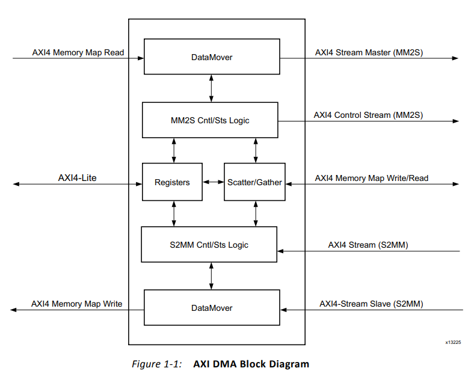
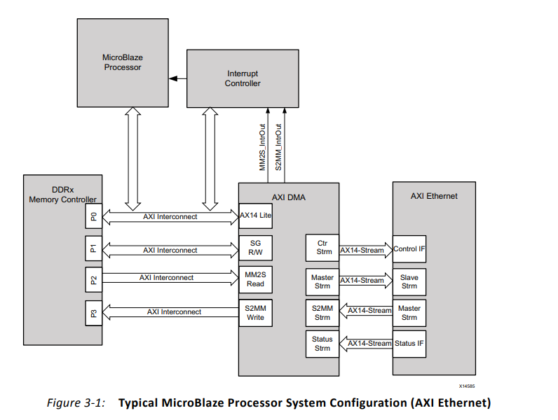

# AXI DMA简介
## 1、概述：
AXI DMA为内存与AIX4-Stream外设之间提供高带宽直接内存访问，释放CPU的数据搬运任务（可选用S/G功能）。
## 2、Block Design：
AXI-Lite接口对寄存器进行配置、MM2S：存储器映射转AXI4-Stream，S2MM：AXI4-Stream转存储器映射。
## 3、典型DMA应用：

## 4、AXI DMA编程顺序：
### 1、Direct Register Mode（简单DMA）：
此模式提供再MM2S与S2MM通道上的简单的DMA传输配置，使用少量FPGA资源，通过访问DMACR、源地址或目的地址和长度寄存器发起DMA传输。当传输完成后，如果使能产生中断输出，那么DMASR寄存器相关联的通道会有效。

