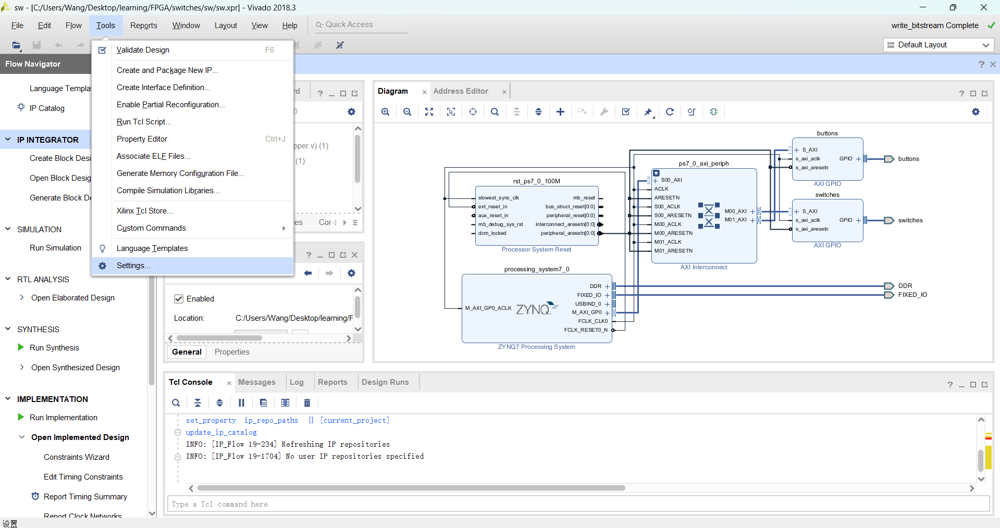

# HLS生成IP
1、首先打开HLS工具，并创建项目。（注意路径中不要含有中文，不然会导致后面生成IP时报错。）

2、随后在explorer中找到source并创建cpp文件，使用c++语言对IP功能进行描述。

3、最后执行c代码，并生成最终的RTL文件，完成自定义IP生成。
4、注意，如果在到出RTL过程中出现报错，请首先检查项目路径中是否存在中文字符，其次如果使用的vivado版本为2018版，则存在bug，需要将电脑的时间调整至2018年以及之前。（或到xilinx官方下载对应的补丁文件。）


# 导入HLS生成的IP并在jupyter中使用
1、选择Tools选项中的settings。

2、找到IP中的Repository选项，点击右边加号并找到IP路径即可。

3、最后就能够在Block Design中找到自定义的IP并加以运用。
4、随后在vivado界面左边工具栏中找到Creat Block Design，创建完成后即可在Diagram面板中点击加号并搜索自己的自定义IP，并将加入的addIP改名为scala_add。

5、加载好IP后点击Run进行自动连线，完成后到source中右键pynq_hls_adder并创建顶层模块，接着点击左边导航栏的Generate Bitstream，并等待完成。


6、随后连接网络打开jupyter，并将pynq_hls_adder项目中的tcl、bit、hwh文件上传（把pynq_hls_adder_wrapper.bit文件重命名为pynq_hls_adder.bit）。


7、在jupyter中新建一个Jupyter Notebook，并写入以下代码：
```
from pynq import Overlay
overlay = Overlay('/pynq_hls_adder.bit')
```
另外，可以使用overlay?代码查看ip的具体情况：

8、验证IP功能正确性：

9、创建驱动Driver，输入以下代码：
```
from pynq import DefaultIP
 
class AddDriver(DefaultIP):
    def __init__(self, description):
        super().__init__(description=description)
 
    bindto = ['xilinx.com:hls:hls_adder:1.0']
 
    def add(self, a, b):
        self.write(0x10, a)
        self.write(0x18, b)
        return self.read(0x20)
```
其中的bindto内容可以在vivado工程Block Desgin界面选中对应的IP，选中Block Properties，下方Properties中即可找到。bindto的具体解释在https://pynq.readthedocs.io/en/v2.6.1/overlay_design_methodology/python_overlay_api.html#creating-ip-drivers中可以找到

10、最后，输入以下代码即可调用驱动：
 ```
 overlay = Overlay('./pynq_hls_adder.bit')
overlay?
overlay.scalar_add.add(15,20)
 ```
