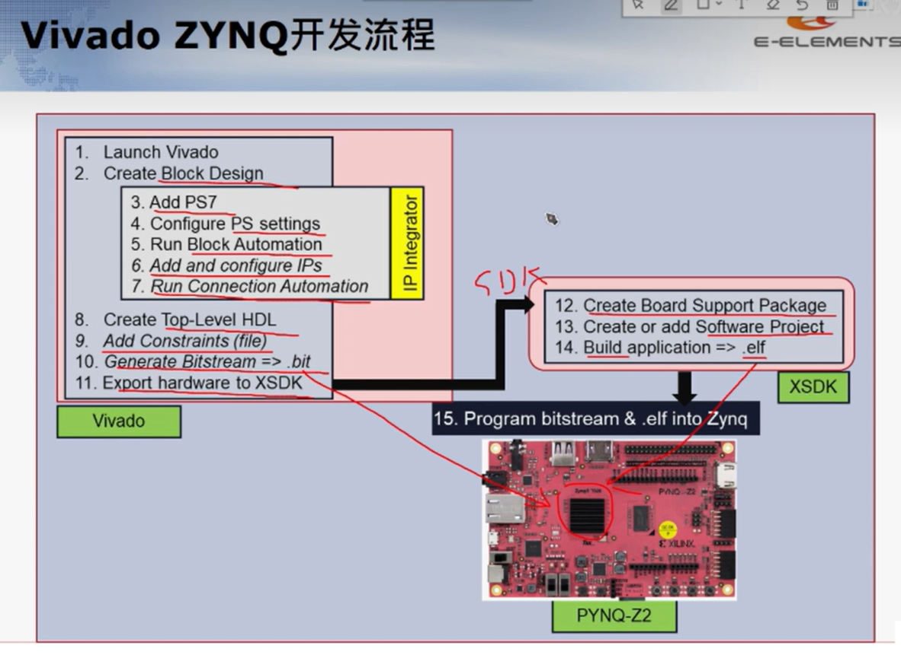

# Pynq开发文档
网址：https://pynq.readthedocs.io/en/v2.6.1/index.html#

# Pynq开发流程

# 细节

## 1、hwh后缀文件作用
在Vivado项目中，.hwh文件是硬件手稿文件（Hardware Handoff）的扩展名，它包含了项目中硬件设计的所有信息，包括但不限于：

* 设计约束：包括时序约束、I/O约束等，用于确保硬件设计满足特定的性能和功能要求。
* 设计实现：包含了设计的综合结果、布局和布线信息。
* 生成的比特流：是用于配置FPGA的二进制文件，包含了所有硬件逻辑和资源分配的信息。

## 2、